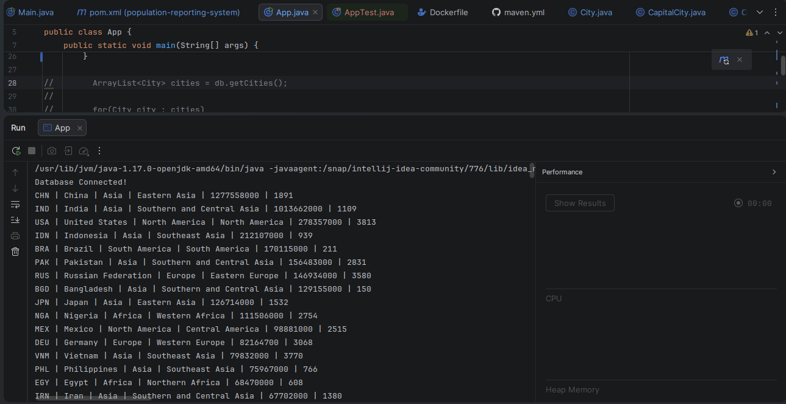
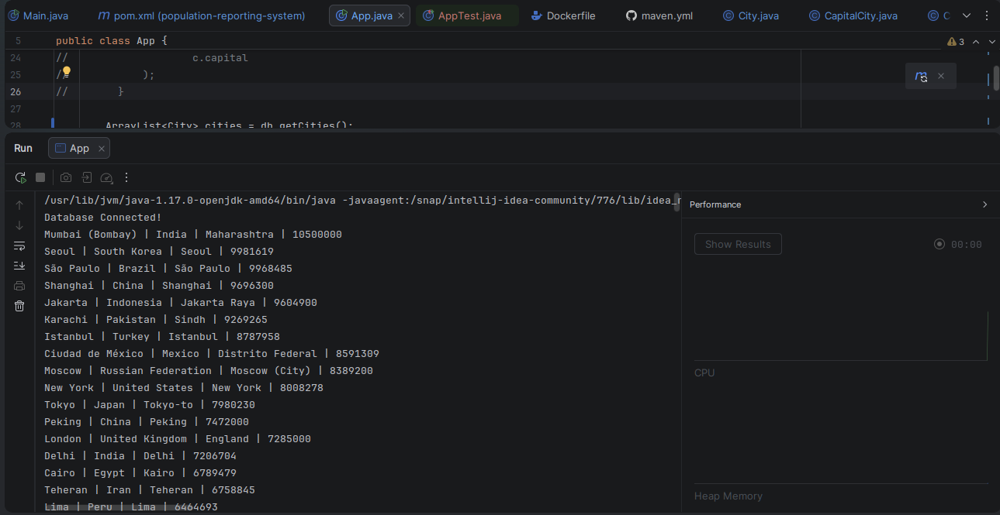
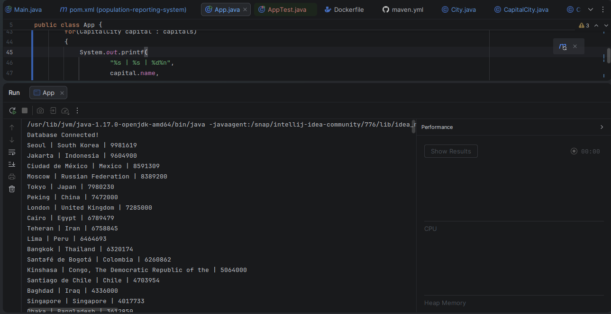
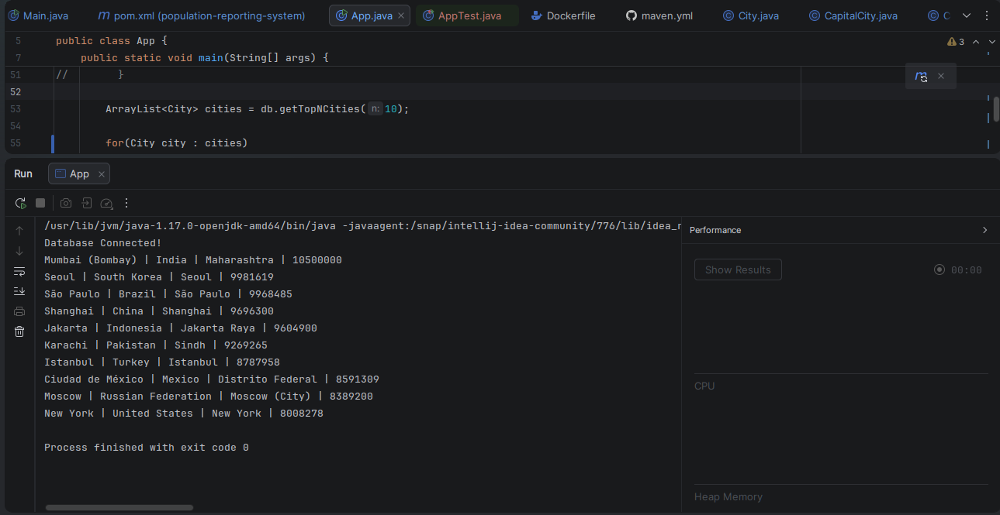
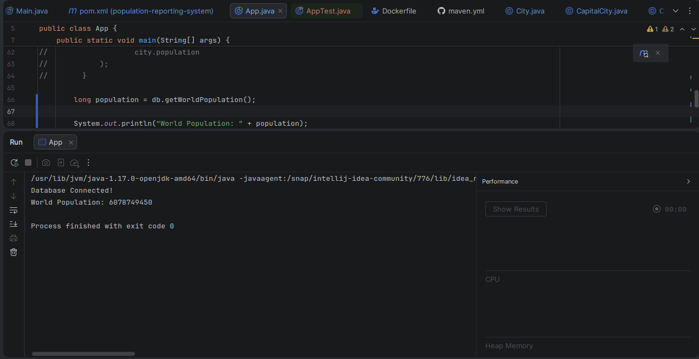
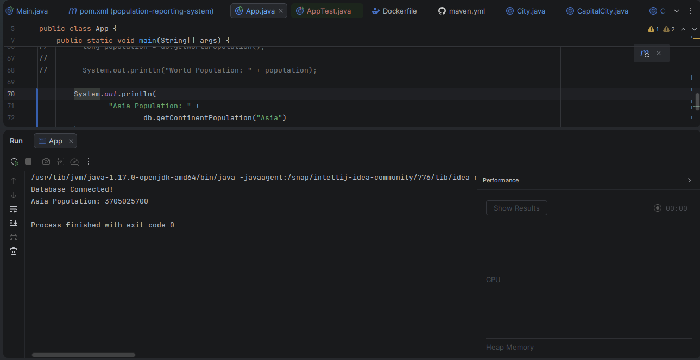
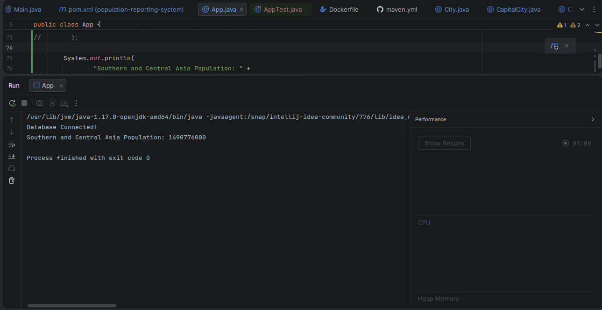
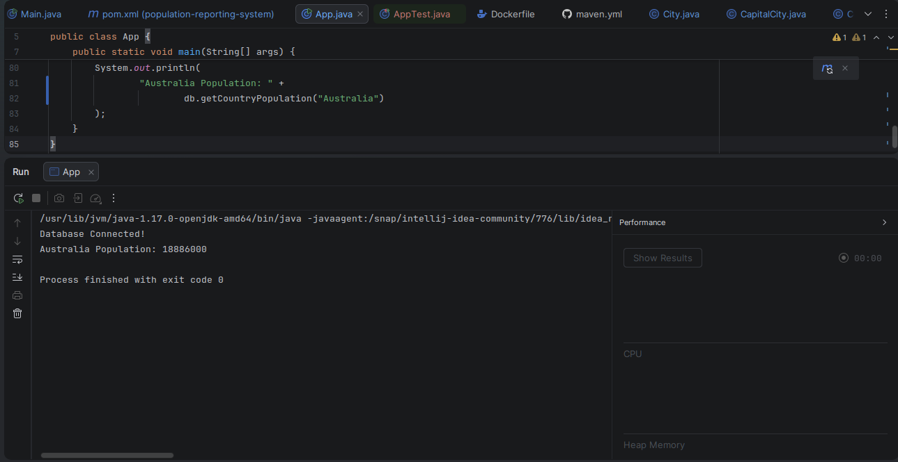

# Population Reporting System

## Description

This project is a Java-based application that generates population reports using the World database. The system retrieves and displays population information for countries, cities, capital cities, continents, regions, and countries.

## Requirements Completed

8 out of 8 requirements implemented (100%).

| ID | Requirement           | Met | Screenshot                               |
| -- | --------------------- | --- | ---------------------------------------- |
| 1  | Countries Report      | Yes |            |
| 2  | Cities Report         | Yes |               |
| 3  | Capital Cities Report | Yes |             |
| 4  | Top N Cities Report   | Yes |           |
| 5  | World Population      | Yes |      |
| 6  | Continent Population  | Yes |  |
| 7  | Region Population     | Yes |     |
| 8  | Country Population    | Yes |       |

## Technologies Used

* Java 17
* Maven
* MySQL
* Docker
* GitHub Actions
* JUnit 5

## Project Structure

* Database connection using MySQL Connector/J
* Maven for dependency management
* Docker support for containerization
* GitHub Actions for continuous integration
* JUnit 5 for unit testing

## How to Run

1. Clone the repository.
2. Import the World database into MySQL.
3. Update database connection details if required.
4. Build the project:

```bash
mvn clean package
```

5. Run the application from IntelliJ IDEA or using the generated JAR file.

## Testing

Run the following command:

```bash
mvn test
```

All unit tests should pass successfully.

## Screenshots

The screenshots demonstrating all implemented requirements are available in the `screenshots` folder.

## Author

Abdullah
